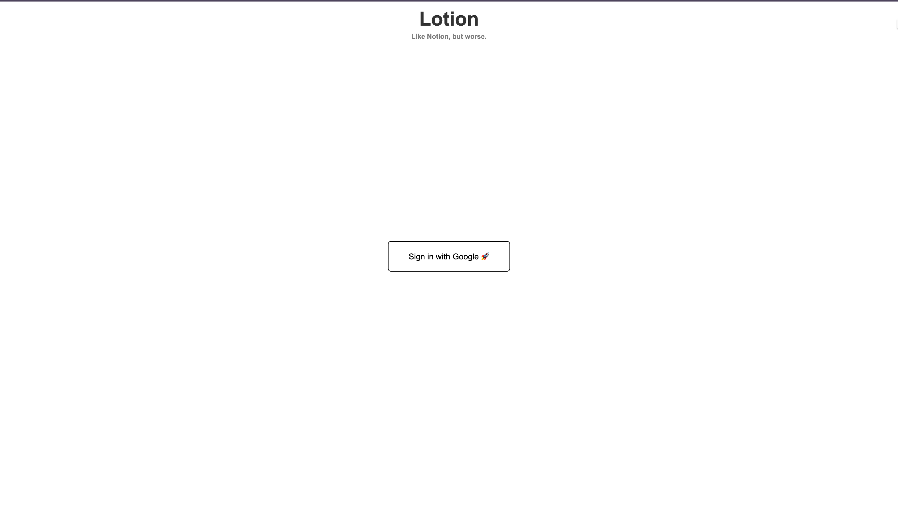
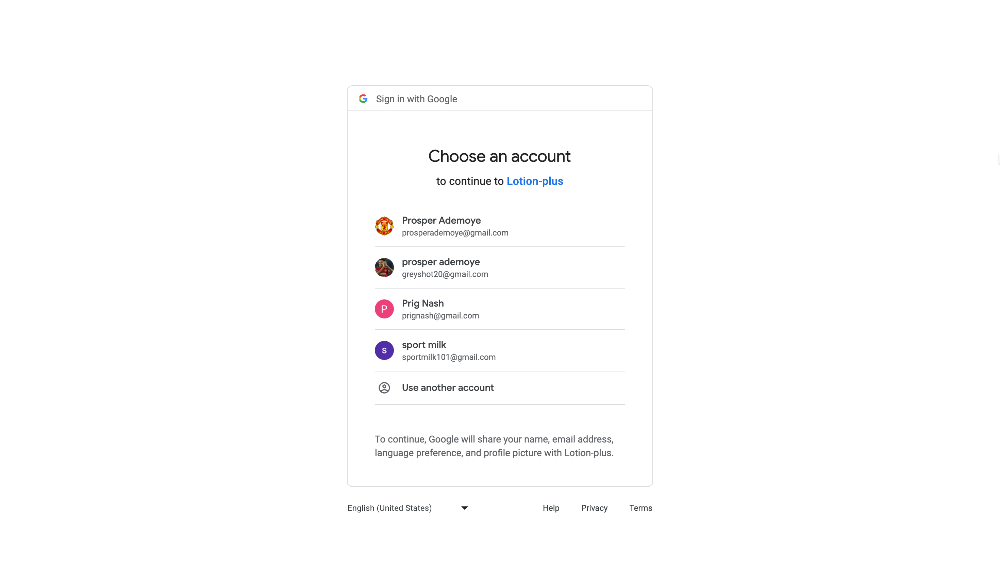
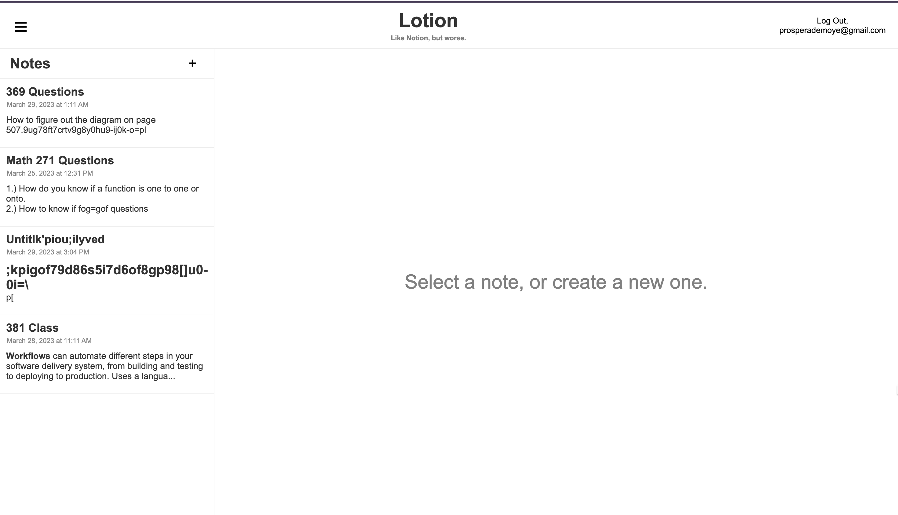
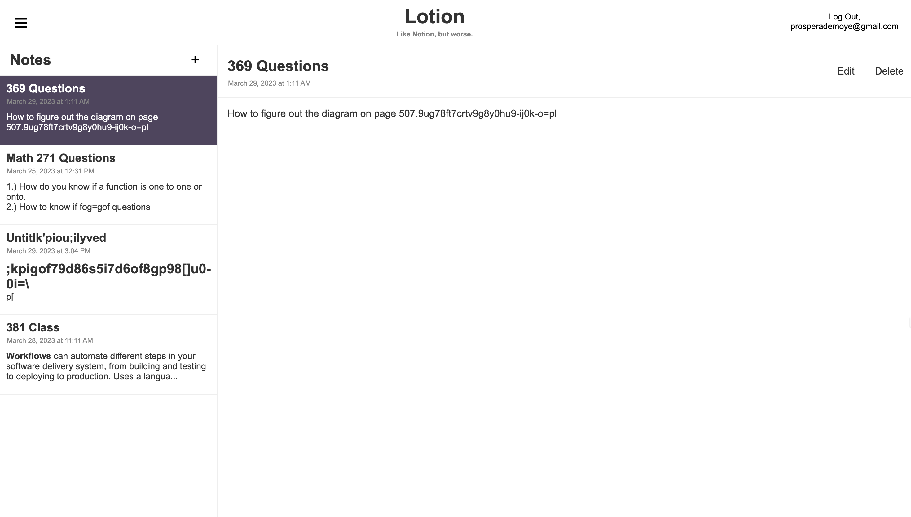
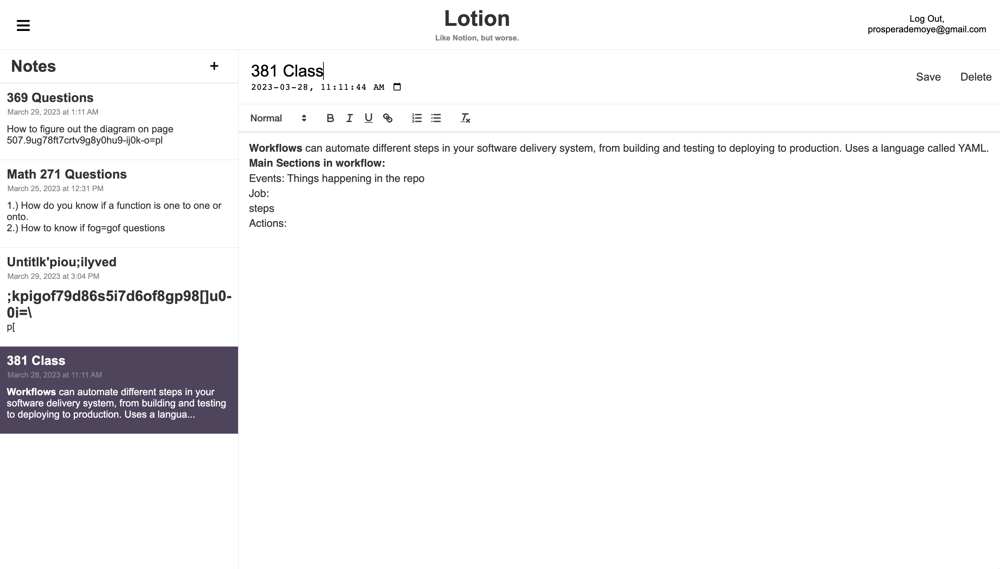
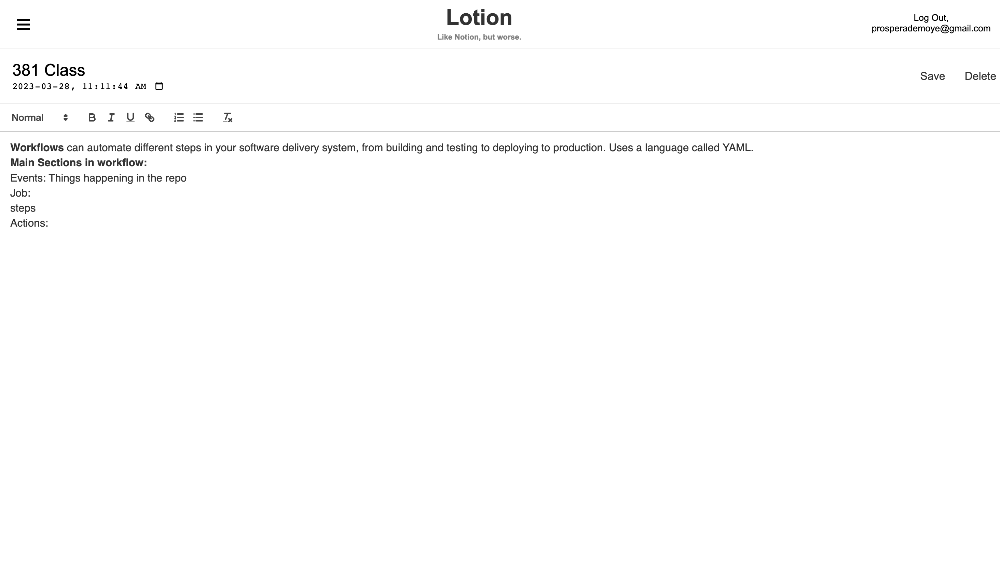

# Lotion (Notes Website)

Developed a Notion-like website that allows users to add, delete, and save notes, as well as format their notes using
highlight, italics, bold, etc.
- Used HTML, CSS, and React for the frontend and AWS (Amazon Web Services) and Terraform for the backend.
- Implemented Google authentication, prompting users to login to the website with their Google account, with the notes
stored on the cloud for each user.
- Used AWS DynamoDB for the database, with a setup that enables easy storage and retrieval of notes for each user.
Implemented three Lambda functions for retrieving notes, saving notes, and deleting notes, with email and access token
used for user authentication.

